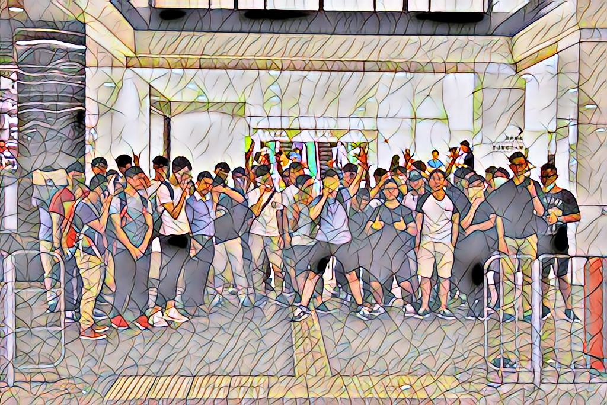

# 🎨 Video Style Transfer
This is an implementation of **single-style-per-model, real-time style transfer** in PyTorch.


## 📖 Table of Contents
1. [Usage](#💻-usage)
2. [Background](#🗻-background)
3. [Getting Started](#🎈-getting-started)
4. [Acknowledgments](#🎓-acknowledgments)
5. [Trained Models](#✈-trained-models)
5. [More Examples](#🧪-more-examples)
## 💻 Usage
### Video Stylization
#### Video File

*A train arriving the station in the mosaic style*

#### Real-time Video
*The author is too shy to reveal himself, but it does work ><*

### Image Stylization

*A random group photo in the mosaic style*

## 🗻 Background
### Neural Style Transfer
Image/ Video stylization is a technique in the realm of **non-photorealistic rendering (NPR)** which stylizes an input content image/ video with a desired style. With the emerge of deep learning, a new class of algorithm, **neural style transfer (NST)**, has been introduced to tackle the problem by utilizing artificial neural networks. There are mainly two approaches in NST, **optimization-based style transfer** and **feed-forward style transfer**. While the optimization-based approach requires tons of iterations for a single transfer, the feed-forward method makes avail of learned parameters to perform non-linear transformation on content image in only one iteration. The later one, therefore, enables fast generation of stylized contents and makes real-time style transfer possible. It can be further classified into three subcategories: **single style per model, multiple style per model, and arbitrary style per model**. In this project, we place the emphasis on the single-style-per-model style transfer.

## 🎈 Getting Started
### Prerequisite
1. Create and activate a virtual environment:
```
python -m venv venv/vst
source venv/vst/Scripts/activate  (for Windows)
source venv/vst/bin/activate  (for Linux)
```

2. Install the required dependencies:
```
pip install -r requirements.txt
```

3. Download the pre-trained VGG nets for loss computation if needed: [VGG16](https://download.pytorch.org/models/vgg16_features-amdegroot-88682ab5.pth), [VGG19](https://download.pytorch.org/models/vgg19-dcbb9e9d.pth).

4. Download some videos for the content dataset from stock video providers such as [Pexels](https://www.pexels.com/videos/), [videvo](https://www.videvo.net/) ... etc if needed. Then, extract the frames using `notebook/data_util.ipynb`.

### Suggested Folder Structure
```
├── data
│   ├── content           # put the raw videos here
│   │   ├── *.mp4
│   │   ├── frames        # put the frames extracted here
│   │   │   ├── *.jpg
│   ├── style             # put the style images here
│   │   ├── *.jpg
│   ├── validation        # put the validation images/ videos here
│   │   ├── *.jpg
│   │   ├── *.mp4
├── network
│   ├── loss_network.py   # the general architecture of pre-trained VGG nets
│   ├── style_network.py  # the architecture of the stylizing network
├── notebook
│   ├── data_util.ipynb   # the utilty for extracting frames from video
├── pretrained_models     # put pretrained VGG nets here
│   ├── *.pth
├── stylization           # the package used by stylize.py
│   ├── content_source    # various data sources and factory are defined here
│   │   ├── *.py
│   ├── __init__.py
│   ├── enum_class.py
│   ├── main.py           # parses arguments and controls data source and processor
│   ├── processor.py      # stylizes input data
├── stylizied_output      # the stylizied output is generated here
│   ├── *.jpg
│   ├── *.mp4
├── train                 # the package used by train.py
│   ├── __init__.py
│   ├── dataset.py        # defines the dataset class for content images
│   ├── loss.py           # defines various loss functions
│   ├── main.py           # parses arguments and controls the training process
├── trained_models        # put the finalized, trained models here, used for stylization
│   ├── *.pth.tar
├── training_models       # the models saved in training are put here
│   ├── *.pth.tar
├── training_output       # the stylized output saved in training are put here for evaluation
│   ├── *.jpg
├── __init__.py
├── config.py             # stores the configuration related to model architecture and loss functions
├── stylize.py            # the entry point for stylization
├── train.py              # the entry point for training
├── utils.py              # contains utility functions used across the entire repository
├── requirements.txt
├── README.md
└── .gitignore
```

### Training
#### Command
```
python train.py \
--device cuda \
--num_workers 8 \
--batch_size 1 \
--img_size 256 \
--content_dir data/content/frames \
--style_path data/style/<style image file> \
--model_dir training_models \
--model_name <model name>.pth.tar \
--load_model False \
--save_model True \
--save_freq 300 \
--train_output_dir training_output \
--loss_net_choice VGG16 \
--loss_net_path pretrained_models/vgg16_features-amdegroot-88682ab5.pth \
--epochs 1 \
--lr 2.5e-4 \
--lambda_content 10 \
--lambda_style 100 \
--lambda_regu 1e-2 \
--lambda_noise 1e-5 \
--noise_per_img 20000 \
--noise_range 200
```

#### Parameters
| Parameter          | Type      | Description/ Options                                                                                                                |
| :----------------- | :-------- | :---------------------------------------------------------------------------------------------------------------------------------- |
| `device`           | `string`  | Optional. Either `cuda` or `cpu`.                                                                                                   |
| `num_workers`      | `integer` | Optional. Number of subprocess used in data loading.                                                                                |
| `batch_size`       | `integer` | Optional. Batch size in each epoch.                                                                                                 |
| `img_size`         | `integer` | Optional. The standardized image size for training.                                                                                 |
| `content_dir`      | `string`  | Required. The directory storing the content images.                                                                                 |
| `style_path`       | `string`  | Required. The path of the style image.                                                                                              |
| `model_dir`        | `string`  | Optional. The directory storing stylizing models.                                                                                   |
| `model_name`       | `string`  | Required. The name of the model to be trained.                                                                                      |
| `load_model`       | `boolean` | Optional. It will load the previouly trained model weights by default.                                                              |
| `save_model`       | `boolean` | Optional. It will save the model to be trained by default.                                                                          |
| `save_freq`        | `integer` | Optional. It will store the image generated every 300 batches by default.                                                           |
| `train_output_dir` | `string`  | Optional. The directory for storing images generated.                                                                               |
| `loss_net_choice`  | `string`  | Required. Either `VGG16` or `VGG19`.                                                                                                |
| `loss_net_path`    | `string`  | Required. The path where the loss network is located at.                                                                            |
| `epochs`           | `integer` | Optional. The number of training epochs.                                                                                            |
| `lr`               | `float`   | Optional. The learning rate.                                                                                                        |
| `lambda_content`   | `float`   | Optional. The weighting applied to content loss.                                                                                    |
| `lambda_style`     | `float`   | Optional. The weighting applied to style loss.                                                                                      |
| `lambda_regu`      | `float`   | Optional. The weighting applied to regularization.                                                                                  |
| `lambda_noise`     | `float`   | Optional. The weighting applied to noise loss.                                                                                      |
| `noise_per_img`    | `integer` | Optional. The number of iterations of adding noise to a random pixel in the content image.                                          |
| `noise_range`      | `integer` | Optional. The maximum noise value added to a random pixel. Note that the final pixel will be clipped. It should be within [0, 255]. |

### Stylization
#### Command
```
python stylize.py \
--content_type video \
--source data/validation/<video file> \
--device cuda \
--max_size 1024 \
--model_path trained_models/<trained model name>.pth.tar \
--output_dir stylized_output \
--output_name <name of the stylized output file> \
--real_time True \
--save_output True
```

#### Parameters
| Parameter      | Type      | Description/ Options                                              |
| :------------- | :-------- | :---------------------------------------------------------------- |
| `content_type` | `string`  | Required. Either `video`, `webcam`, or `image`.                   |
| `source`       | `string`  | Required. The path of the content source. Use `0` for `webcam`.   |
| `device`       | `string`  | Optional. Either `cuda` or `cpu`.                                 |
| `max_size`     | `integer` | Optional. The maximum length for any side of the stylized output. |
| `model_path`   | `string`  | Required. The path of the stylizing model.                        |
| `output_dir`   | `string`  | Optional. The directory of the stylized output.                   |
| `output_name`  | `string`  | Optional. The file name of the stylized output.                   |
| `real_time`    | `boolean` | Optional. It will show the video output in real time by default.  |
| `save_output`  | `boolean` | Optional. It will save the stylized output by default.            |

## ✈ Trained models
The following models are trained with a training dataset of around `6,800 frames` extracted from `16 videos`, of themes such as city, nature, marine, sports, public transports. By default, the learning rate, image size, and batch size are `2.5e-4`, `256`, and `1`. VGG16 is picked as the loss network, using `ReLU1_2`, `ReLU2_2`, `ReLU3_3`, `ReLU4_3` for computing style loss and `ReLU2_2` for content loss. Note that the weightings picked in each epoch vary, instead of using consistent weightings throughout all epochs, easing the hyperparameter tuning process.

### [**Mosaic**](https://drive.google.com/file/d/1dc1NJESOLwg_XN8sd25HfLHLh3wUJyzS/view?usp=sharing)
Training details:
| Epoch | lambda_content | lambda_style | lambda_regu | lambda_noise |
| :---- | :------------- | :----------- | :---------- | :----------- |
| `1`   | `50000`        | `25`         | `1e-3`      | `1e-2`       |
| `2`   | `25000`        | `25`         | `1e-3`      | `1e-2`       |
| `3`   | `5000`         | `25`         | `1e-3`      | `1e-2`       |

### The Starry Night
Training details:
| Epoch | lambda_content | lambda_style | lambda_regu | lambda_noise |
| :---- | :------------- | :----------- | :---------- | :----------- |
| `1`   | `10`           | `100`        | `1e-2`      | `1e-5`       |
| `2`   | `500`          | `5`          | `1e-2`      | `1e-2`       |

There are 4 variants trained, with a difference of 'how strong the style is'. They are trained by using only a portion of training dataset in the second epoch.  
[**Protostar**](https://drive.google.com/file/d/134XOD3_ivRY1LfReus-c9MVHbUuyj4YE/view?usp=sharing) - The style is weakest, `6000 images` are used in the second epoch.  
[**Star**](https://drive.google.com/file/d/1oeercfONinJuQA3Ve_3zIowFHURxEVxi/view?usp=sharing) - The style is moderate, `4800 images` are used in the second epoch.  
[**Supernova**](https://drive.google.com/file/d/1_SW4fw1qHl8xFNTlTPUonIagq9I0Fypw/view?usp=sharing) - The style is strong, `3600 images` are used in the second epoch.  
[**Black Hole**](https://drive.google.com/file/d/1QGQ5QktTBsIDkFZ1Ui7YqwPsgRRWnT74/view?usp=sharing) - The style is very strong, `2400 images` are used in the second epoch.  

## 🧪 More Examples
Please stay tuned!

## 🎓 Acknowledgments
- [Fast Style Transfer](https://arxiv.org/abs/1603.08155)
- [Temporal Loss by Optical Flow](https://openaccess.thecvf.com/content_cvpr_2017/papers/Huang_Real-Time_Neural_Style_CVPR_2017_paper.pdf)
- [Temporal Loss by Random Noise](https://arxiv.org/abs/1604.08610)
